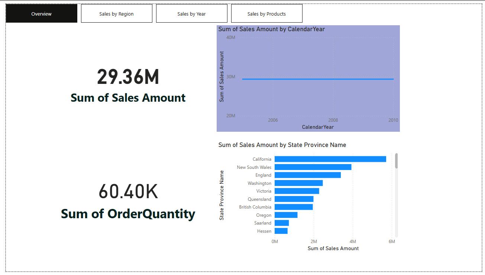
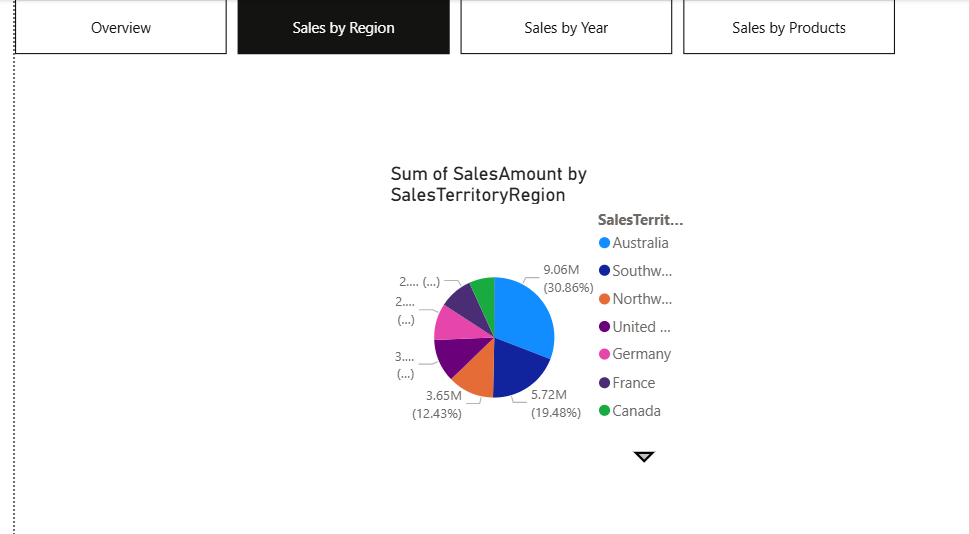

# Sales-Performance-Dashboard
Power BI Sales Dashboard Project

## 📊 Project Overview
This project analyzes sales performance using Power BI.

The dashboard provides insights into:
- Total Sales
- Sales by Region
- Sales by Year
- Sales by Products

---

## 📁 Tools Used
- Power BI
- DAX
- Data Modeling

---

## 📈 Dashboard Pages

### 1️⃣ Overview
Shows total sales and key performance indicators.

---

### 2️⃣ Sales by Region
Displays regional performance comparison.

---

### 3️⃣ Sales by Year
Shows yearly sales trends.

---

### 4️⃣ Sales by Products
Highlights the best-selling products.

---

## 🚀 Key Insights
- Identified top-performing regions
- Analyzed yearly growth if any
- Determined best-selling products

---

## 📌 Author
Vindya Ashanthi
